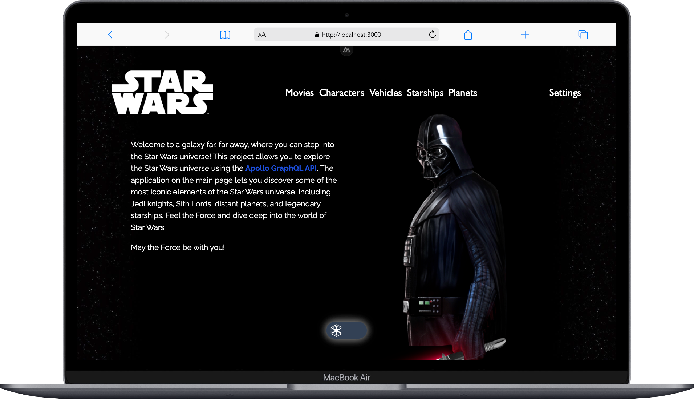
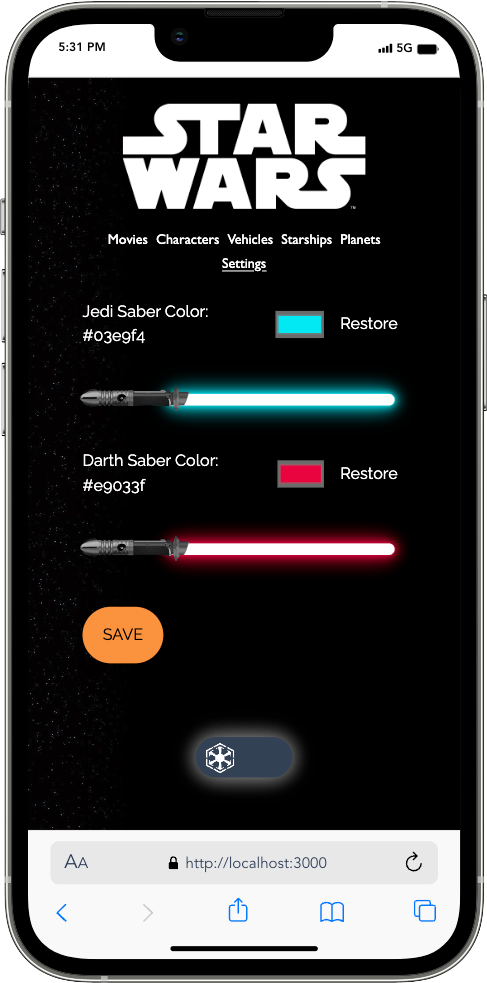
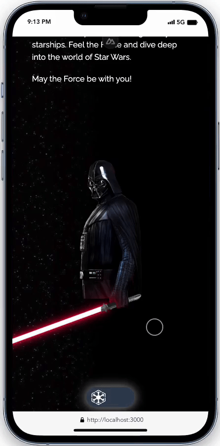
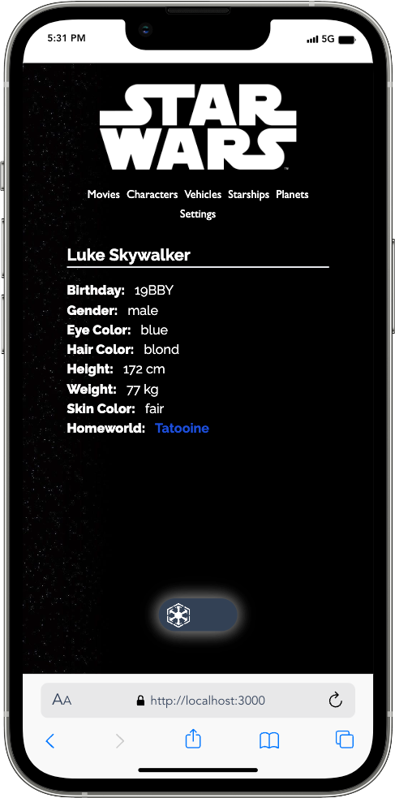

# Nuxt 3 Star Wars Wiki

## Project Description

Star Wars Wiki is a web application created using Nuxt 3 and the Star Wars GraphQL API, providing access to comprehensive information about the Star Wars universe. This project aims to offer an original resource for Star Wars enthusiasts.

## Live Demo

[](https://app.netlify.com/sites/starwarsgql/deploys) <br>
<a href="https://starwarsgql.netlify.app/" target="_blank">Live Demo Link</a>

## Installing Project

```sh
git clone https://github.com/alihandgrmnclr/starwarsGql.git
```

#### Installing Dependencies

```sh
npm install
```

#### Compile and Hot-Reload for Development

```sh
npm run dev
```

#### Compile and Minify for Production

```sh
npm run build
```

## Tech Stack

- Nuxt 3
- GraphQL
- Lodash
- PrimeVue
- Tailwind
- VueUse

<div align="center" class="bg-blue-500">
   
</div>
<div align="center">
  
  
  
</div>
